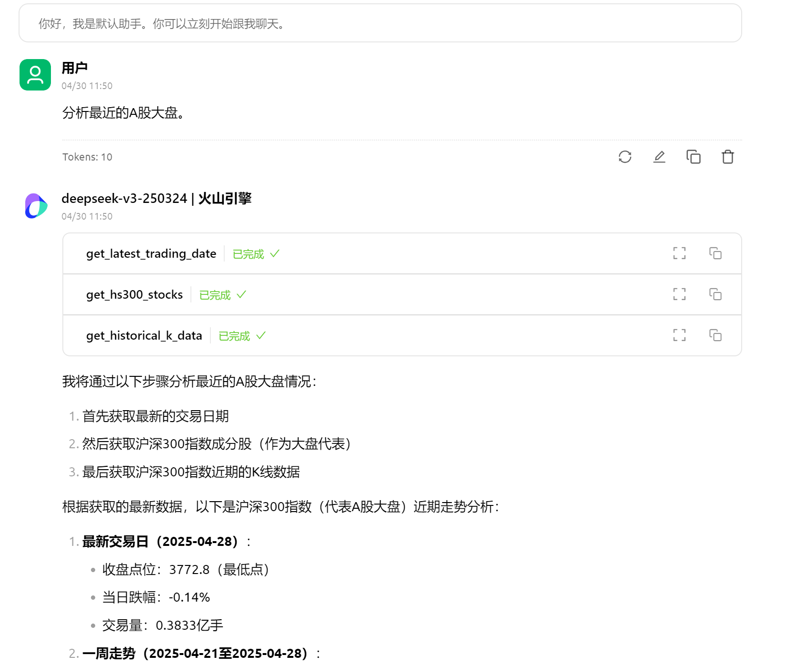
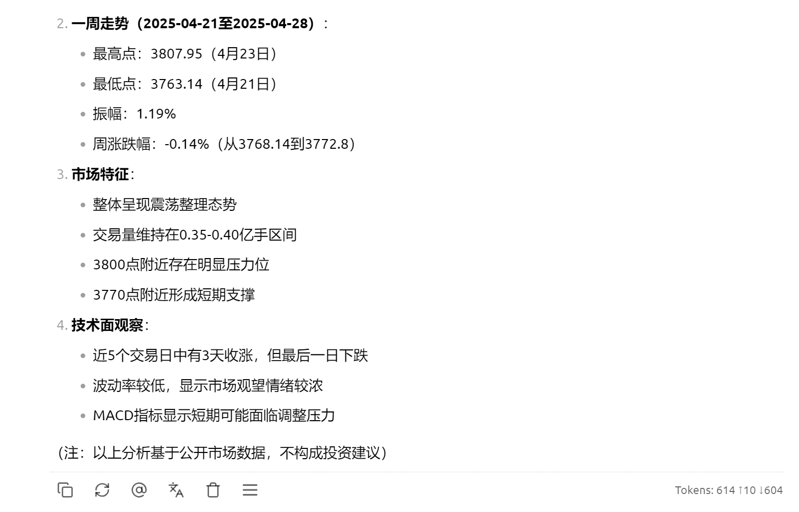

[](https://mseep.ai/app/24mlight-a-share-mcp-is-just-i-need)

<div align="center">

# 📊 a-share-mcp 📈


[](https://opensource.org/licenses/MIT)
[](https://www.python.org/downloads/)
[](https://github.com/astral-sh/uv)
[](https://github.com/model-context-protocol/mcp-spec)


</div>
A股mcp。

本项目是一个基于专注于 A 股市场的 MCP 服务器，它提供股票基本信息、历史 K 线数据、财务指标、宏观经济数据等多种查询功能，理论上来说，可以回答有关 A 股市场的任何问题，无论是针对大盘还是特定股票。

<div align="center">

</div>

## 项目结构

```
a_share_mcp/
│
├── mcp_server.py           # 主服务器入口文件
├── pyproject.toml          # 项目依赖配置
├── README.md               # 项目说明文档
│
├── docs/                   # 项目文档
│   ├── baostock_com.md     # Baostock API文档
│   ├── mcp_server_docs.md  # 服务器文档
│   └── dev_docs/           # 开发文档
│       ├── AppFlow.md
│       ├── ImplementationPlan.md
│       └── PRD.md
│
├── src/                    # 源代码目录
│   ├── __init__.py
│   ├── baostock_data_source.py   # Baostock数据源实现
│   ├── data_source_interface.py  # 数据源接口定义
│   ├── utils.py                  # 通用工具函数
│   │
│   ├── formatting/         # 数据格式化模块
│   │   ├── __init__.py
│   │   └── markdown_formatter.py  # Markdown格式化工具
│   │
│   └── tools/              # MCP工具模块
│       ├── __init__.py
│       ├── base.py                # 基础工具函数
│       ├── stock_market.py        # 股票市场数据工具
│       ├── financial_reports.py   # 财务报表工具
│       ├── indices.py             # 指数相关工具
│       ├── market_overview.py     # 市场概览工具
│       ├── macroeconomic.py       # 宏观经济数据工具
│       ├── date_utils.py          # 日期工具
│       └── analysis.py            # 分析工具
│
└── resource/               # 资源文件
    └── img/                # 图片资源
        ├── img_1.png       # CherryStudio配置示例
        └── img_2.png       # CherryStudio配置示例
```

<div align="center">

</div>

## 功能特点

<div align="center">
<table>
  <tr>
    <td align="center"><br><b>股票基础数据</b></td>
    <td align="center"><br><b>历史行情数据</b></td>
    <td align="center"><br><b>财务报表数据</b></td>
  </tr>
  <tr>
    <td align="center"><br><b>宏观经济数据</b></td>
    <td align="center"><br><b>指数成分股</b></td>
    <td align="center"><br><b>数据分析报告</b></td>
  </tr>
</table>
</div>

## 先决条件

1. **Python 环境**: Python 3.10+
2. **依赖管理**: 使用 `uv` 包管理器安装依赖
3. **数据来源**: 基于 Baostock 数据源，无需付费账号。在此感谢 Baostock。
4. 提醒：本项目于 Windows 环境下开发。

## 数据更新时间

> 以下是 Baostock 官方数据更新时间，请注意查询最新数据时的时间点 [Baostock 官网](http://baostock.com/baostock/index.php/%E9%A6%96%E9%A1%B5)

**每日数据更新时间：**

- 当前交易日 17:30，完成日 K 线数据入库
- 当前交易日 18:00，完成复权因子数据入库
- 第二自然日 11:00，完成分钟 K 线数据入库
- 第二自然日 1:30，完成前交易日"其它财务报告数据"入库
- 周六 17:30，完成周线数据入库

**每周数据更新时间：**

- 每周一下午，完成上证 50 成份股、沪深 300 成份股、中证 500 成份股信息数据入库

> 所以说，在交易日的当天，如果是在 17:30 之前询问当天的数据，是无法获取到的。

## 安装环境

在项目根目录下执行：

要启动 A 股 MCP 服务器，请按照以下步骤操作：

```bash
# 1. 创建虚拟环境（仅创建，不会安装任何包）
uv venv

# 2. 激活虚拟环境
# Windows
.venv\Scripts\activate
# macOS/Linux
# source .venv/bin/activate

# 3. 安装所有依赖（必须在激活的虚拟环境中执行）
uv sync
```

## 使用：在 MCP 客户端中配置服务器

在支持 MCP 的客户端（如 VS Code 插件、CherryStudio 等）中，你需要配置如何启动此服务器。 **推荐使用 `uv`**。

### 方法一：使用 JSON 配置的 IDE (例如 Cursor、VSCode、Trae 等)

对于需要编辑 JSON 文件来配置 MCP 服务器的客户端，你需要找到对应的能配置 MCP 的地方（各个 IDE 和桌面 MCP Client 可能都不一样），并在 `mcpServers` 对象中添加一个新的条目。

**JSON 配置示例 (请将路径替换为你的实际绝对路径):**

```json
{
  "mcpServers": {
    "a-share-mcp": {
      "command": "uv", // 或者 uv.exe 的绝对路径, 例如: "C:\\path\\to\\uv.exe"
      "args": [
        "--directory",
        "C:\\Users\\YourName\\Projects\\a_share_mcp", // 替换为你的项目根目录绝对路径，不一定是C盘，按实际的填写
        "run",
        "python",
        "mcp_server.py"
      ],
      "transport": "stdio"
      // "workingDirectory": "C:\\Users\\YourName\\Projects\\a_share_mcp", // 使用 uv --directory 后，此项可能不再必需，但建议保留作为备用
    }
    // ... other servers ...
  }
}
```

**注意事项:**

- **`command`**: 确保填写的 `uv` 命令或 `uv.exe` 的绝对路径是客户端可以访问和执行的。
- **`args`**: 确保参数列表完整且顺序正确。
- **路径转义**: 路径需要写成双反斜杠 `\\`。
  > 这是 Windows 系统特有的情况。如果是在 macOS 或 Linux 系统中，路径使用正斜杠/作为目录分隔符，就不需要这种转义处理。
- **`workingDirectory`**: 虽然 `uv --directory` 应该能解决工作目录问题，但如果客户端仍然报错 `ModuleNotFoundError`，可以尝试在客户端配置中明确设置此项为项目根目录的绝对路径。

### 方法二：使用 CherryStudio

在 CherryStudio 的 MCP 服务器配置界面中，按如下方式填写：

- **名称**: `a-share-mcp` (或自定义)
- **描述**: `本地 A 股 MCP 服务器` (或自定义)
- **类型**: 选择 **标准输入/输出 (stdio)**
- **命令**: `uv` (或者填系统中绝对路径下 uv.exe)
- **包管理源**: 默认
- **参数**:

  1. 第一个参数填: `--directory`
  2. 第二个参数填: `C:\\Users\\YourName\\Projects\\a_share_mcp`
  3. 第三个参数填: `run`
  4. 第四个参数填: `python`
  5. 第五个参数填: `mcp_server.py`

  - _确保所有参数按下回车转行隔开的，否则报错（是不是手把手教学了？）_

- **环境变量**: (通常留空)

> Tricks（必看）:
> 有时候在 Cherrystudio 填写好参数后，点击右上方的开关按钮，会发现没任何反应，此时只要随便点击左侧目录任一按钮，跳出 mcp 设置界面，然后再回到 mcp 设置界面，就会发现 mcp 已经闪绿灯配置成功了。

**CherryStudio 使用示例:**
理论上来说，你可以问有关 A 股的任何问题 :)





**重要提示:**

- 确保**命令**字段中的 `uv` 或其绝对路径有效且可执行。
- 确保**参数**字段按顺序正确填写了五个参数。

## 工具列表

该 MCP 服务器提供以下工具：

<div align="center">
  <details>
    <summary><b>🔍 展开查看全部工具</b></summary>
    <br>
    <table>
      <tr>
        <th>🏛️ 股票市场数据</th>
        <th>📊 财务报表数据</th>
        <th>🔎 市场概览数据</th>
      </tr>
      <tr valign="top">
        <td>
          <ul>
            <li><code>get_historical_k_data</code></li>
            <li><code>get_stock_basic_info</code></li>
            <li><code>get_dividend_data</code></li>
            <li><code>get_adjust_factor_data</code></li>
          </ul>
        </td>
        <td>
          <ul>
            <li><code>get_profit_data</code></li>
            <li><code>get_operation_data</code></li>
            <li><code>get_growth_data</code></li>
            <li><code>get_balance_data</code></li>
            <li><code>get_cash_flow_data</code></li>
            <li><code>get_dupont_data</code></li>
          </ul>
        </td>
        <td>
          <ul>
            <li><code>get_trade_dates</code></li>
            <li><code>get_all_stock</code></li>
          </ul>
        </td>
      </tr>
      <tr>
        <th>📈 指数相关数据</th>
        <th>🌐 宏观经济数据</th>
        <th>⏰ 日期工具 & 分析</th>
      </tr>
      <tr valign="top">
        <td>
          <ul>
            <li><code>get_stock_industry</code></li>
            <li><code>get_sz50_stocks</code></li>
            <li><code>get_hs300_stocks</code></li>
            <li><code>get_zz500_stocks</code></li>
          </ul>
        </td>
        <td>
          <ul>
            <li><code>get_deposit_rate_data</code></li>
            <li><code>get_loan_rate_data</code></li>
            <li><code>get_required_reserve_ratio_data</code></li>
            <li><code>get_money_supply_data_month</code></li>
            <li><code>get_money_supply_data_year</code></li>
            <li><code>get_shibor_data</code></li>
          </ul>
        </td>
        <td>
          <ul>
            <!-- <li><code>get_current_date</code></li> -->
            <li><code>get_latest_trading_date</code></li>
            <li><code>get_stock_analysis</code></li>
          </ul>
        </td>
      </tr>
    </table>
  </details>
</div>

## 贡献指南

欢迎提交 Issue 或 Pull Request 来帮助改进项目。贡献前请先查看现有 Issue 和文档。

## ☕️ 请作者喝杯咖啡

如果这个项目对你有帮助，欢迎请我喝杯咖啡 ❤️


## 许可证

本项目采用 MIT 许可证 - 详情请查看 LICENSE 文件

<div align="center">

</div>
